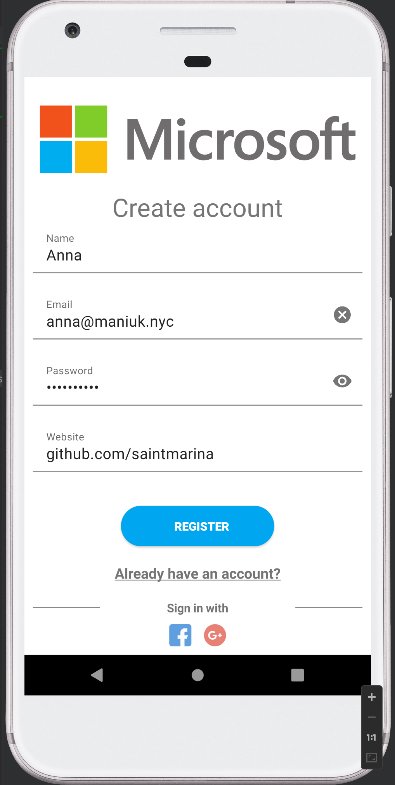
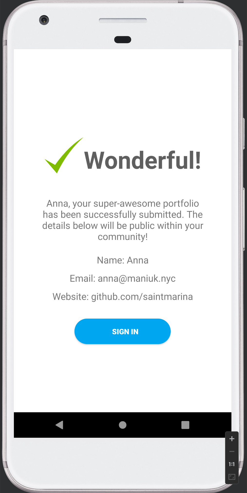

# Microsoft login example

## Deviations from assignment

1. I chose to take out the subtitle from the registration form for two reasons:
  * The text _Use the form below to submit your portfolio..._ is unnecessary as
  the title says it all, and the form is clear.
  * Instead of of having _An email and password are required_, it is better to
  add a red __*__ next to the required fields (I haven't had time to implement
  it). Users don't read text anyways, so the UI should be obvious without having
  to explain it. The current implementation is acceptable as the validation
  error messages are clear, and the user will be informed of the required
  fields if missing.
2. I chose to add link "Already have an account?", it is standard practice on
   sign up pages.
3. I chose to add "Sign up with" with 3rd party authentication methods as it
   provides an easier path for users that don't wish to type information.
4. On the confirmation page, I chose to add "Wonderful!" with a green check mark
   to indicate a successful sign up action. This makes the interaction more
   friendly and to the point.

## Implementation notes

I used the Google Material library for the UI elements.

For validations, I do not validate that the provided website is a valid URL as
some users may chose to provide various social media handles.

Given more time, I would add testing for the validation.

## Screenshots

### Register

### Confirmation

